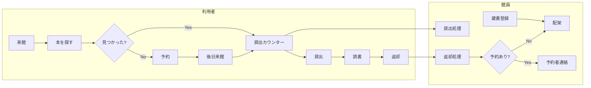

# 業務概要（AS-IS）

<!--
現行業務の全体像を記述します
目的: システム化対象の業務を理解するための資料
-->

最終更新: 2024-04-01

## 目的

このドキュメントは、現行業務（AS-IS）の全体像を理解するためのものです。
システム化の対象となる業務プロセス・組織・役割を可視化します。

## 対象業務

- **業務名**: 青空市立中央図書館 図書貸出業務
- **所管部門**: 青空市教育委員会 図書館課
- **関係者**: 図書館職員（正規5名、非常勤8名）、利用者（約1.5万人登録）

## 業務概要

### 業務の目的

青空市民に対し、図書資料の貸出・閲覧サービスを提供する。
年間約25万冊の貸出を通じて、市民の学習・読書活動を支援する。

### 業務の範囲

#### In Scope（対象範囲）

- 蔵書管理（登録、検索、除籍）
- 貸出・返却業務
- 予約管理
- 利用者登録・管理

#### Out of Scope（対象外）

- 相互貸借（他館との本の貸し借り）
- レファレンスサービス
- 読書推進イベント運営
- 施設管理

## 業務フロー概略図

## 主要プロセス一覧

| No | プロセス名 | 概要 | 担当 | 所要時間 |
|----|-----------|------|------|---------|
| 1 | 蔵書検索 | 利用者・館員が本を探す | 館員/利用者 | 10分/件 |
| 2 | 貸出処理 | 本を利用者に貸し出す | 館員 | 5分/件 |
| 3 | 返却処理 | 返却された本を受け取る | 館員 | 3分/件 |
| 4 | 予約登録 | 貸出中の本を予約する | 館員 | 5分/件 |
| 5 | 利用者登録 | 新規利用者を登録する | 館員 | 10分/件 |
| 6 | 蔵書登録 | 新着本を登録する | 館員 | 15分/件 |

## 組織・役割

### 関係組織

| 組織名 | 役割 | 責任範囲 |
|-------|------|---------|
| 青空市立中央図書館 | 図書館サービスの提供 | 貸出・蔵書管理・利用者対応 |
| 市役所 情報政策課 | デジタル推進 | 予算管理・IT戦略 |
| 市役所 教育委員会 | 図書館の上位組織 | 政策決定・人事 |

### 主要な登場人物（ペルソナ）

#### ペルソナ1: ベテラン司書（山田 恵子）

- **年齢**: 55歳
- **役職**: 司書（正規職員）
- **経験年数**: 30年
- **業務内容**: 貸出・返却対応、レファレンス、蔵書管理
- **ITリテラシー**: 低（PC操作は最低限）
- **抱えている課題**:
  - 繁忙期のExcel管理が限界（ファイルが重い、同時編集できない）
  - 新しいシステムへの不安
  - 長年のやり方を否定されたくない

#### ペルソナ2: 若手司書（佐藤 健太）

- **年齢**: 28歳
- **役職**: 司書（正規職員）
- **経験年数**: 3年
- **業務内容**: 主にカウンター業務、システム導入支援
- **ITリテラシー**: 高（プログラミング経験あり）
- **抱えている課題**:
  - 非効率な業務にフラストレーション
  - やりがいを感じにくい
  - ベテランとの温度差

#### ペルソナ3: 非常勤スタッフ（中村 由美）

- **年齢**: 35歳
- **役職**: 非常勤職員
- **経験年数**: 5年
- **業務内容**: カウンター業務、書架整理
- **ITリテラシー**: 高（元SE）
- **抱えている課題**:
  - 業務負担が増えないか懸念
  - 正規職員との情報格差

#### ペルソナ4: ヘビーユーザー（松本 洋子）

- **年齢**: 62歳
- **役職**: 市民（読書会主宰）
- **月間利用**: 20冊程度
- **ITリテラシー**: 中（スマホは使える）
- **抱えている課題**:
  - スマホで予約したい
  - 新着本の情報がほしい

## 取り扱うデータ

| データ名 | 概要 | 発生源 | 保管場所 | 保管期間 |
|---------|------|-------|---------|---------|
| 蔵書台帳 | 所蔵図書の一覧 | 図書購入時 | Excel（蔵書管理.xlsx） | 永年 |
| 貸出台帳 | 貸出・返却記録 | 貸出時 | Excel（貸出管理.xlsx） | 5年 |
| 利用者台帳 | 利用者情報 | 登録時 | Excel（利用者管理.xlsx） | 登録解除まで |
| 予約表 | 予約順番 | 予約時 | ホワイトボード + 紙メモ | 随時消去 |

## 使用システム・ツール

| システム名 | 用途 | 利用部門 | 備考 |
|-----------|------|---------|------|
| Excel（蔵書管理.xlsx） | 蔵書台帳 | カウンター | 約8万行、起動に時間がかかる |
| Excel（貸出管理.xlsx） | 貸出・返却記録 | カウンター | VLOOKUPで蔵書・利用者を参照 |
| Excel（利用者管理.xlsx） | 利用者情報 | カウンター | 約1.5万行 |
| ホワイトボード | 予約管理 | カウンター | Excelで管理しきれず紙に逃げている |
| Excel | 月次統計集計 | 館長室 | 手作業で集計 |

## 業務量・頻度

| 指標 | 値 |
|------|-----|
| 年間貸出冊数 | 約25万冊 |
| 月間貸出冊数 | 約2万冊 |
| 日間貸出冊数（平日） | 約500冊 |
| 日間貸出冊数（土日） | 約1,200冊 |
| 年間来館者数 | 約18万人 |
| 登録利用者数 | 約1.5万人 |
| 蔵書数 | 約8万冊 |
| 繁忙期 | 夏休み（7〜8月）、年末年始 |

## 関連ドキュメント

- [課題分析](../../pain-points/issues-analysis.md)
- [プロジェクト概要](../../../../AgileLibraryProject.md)
- [組織・登場人物設定](../../../../OrganizationAndCharacters.md)

---

**作成者**: 高橋 美咲
**レビュアー**: 山田 恵子
**承認者**: 森川 誠一
