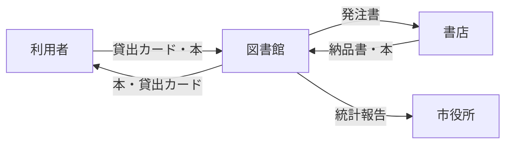
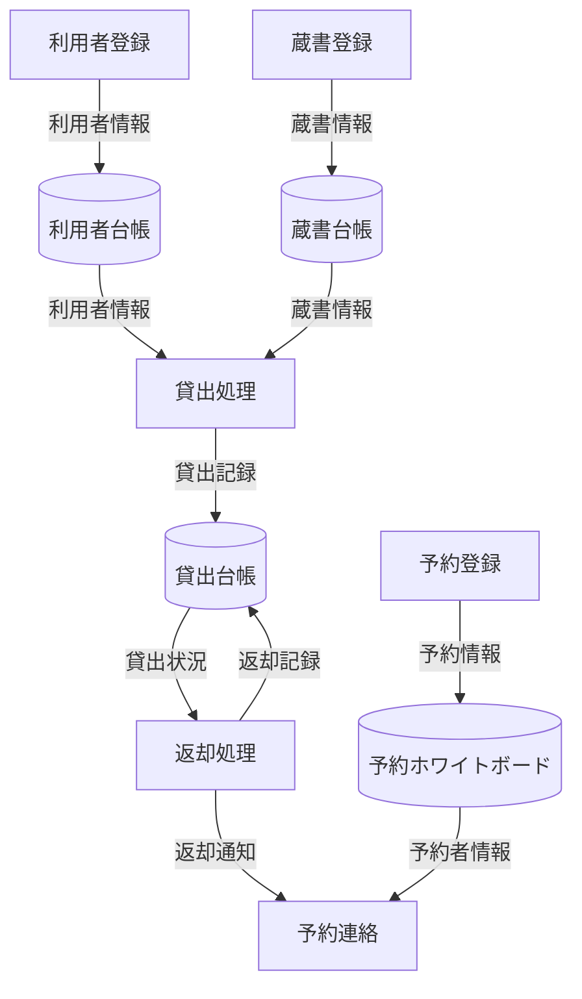
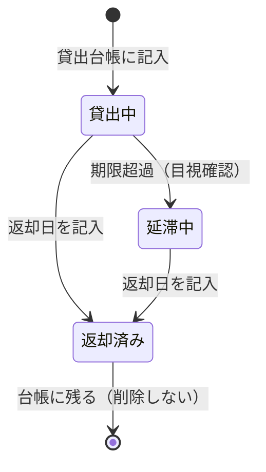
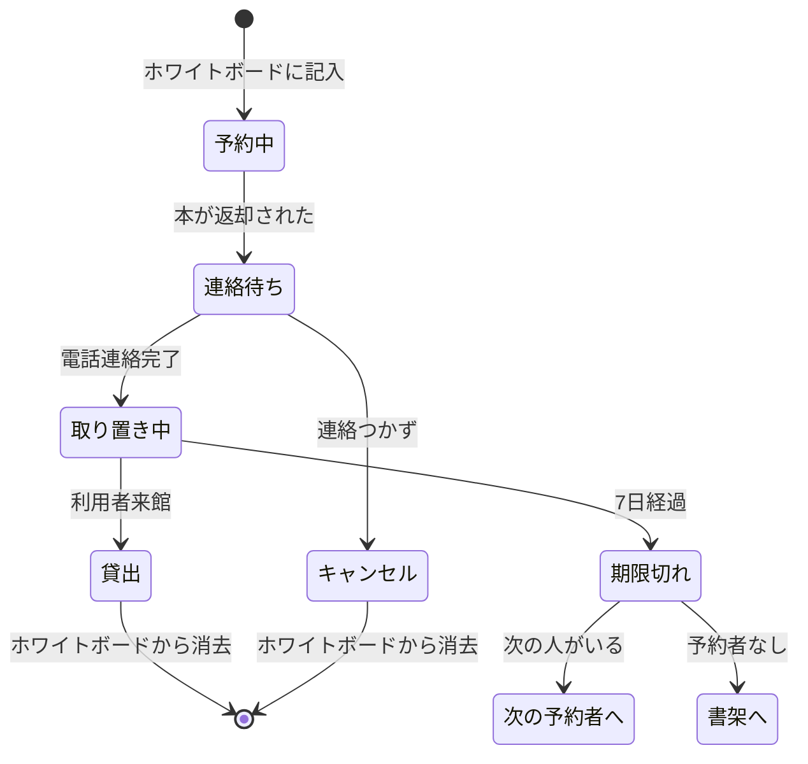

# データフロー図（AS-IS）

<!--
現行業務でのデータの発生・流れ・蓄積を可視化します
紙の台帳、ホワイトボード等のアナログなデータ管理も含みます
-->

最終更新: 2024-04-01

## 目的

このドキュメントは、現行の図書館業務で扱うデータが **どこで発生し、どのように流れ、どこに蓄積されるか** を可視化します。

- 現行のデータ管理方法の把握
- デジタル化による改善ポイントの特定
- システム設計（DB設計・API設計）のインプット

---

## コンテキスト図（レベル0）

図書館業務全体と外部エンティティの関係を示します。



---

## 主要プロセスとデータフロー（レベル1）



### 凡例

| 記号 | 意味 |
|------|------|
| `[ ]` | プロセス（処理） |
| `[( )]` | データストア（保管場所） |
| `-->｜ ｜` | データの流れ |

---

## データエンティティ一覧（現行）

| エンティティ名 | 概要 | 保管場所 | 形式 |
|--------------|------|---------|------|
| 利用者情報 | 利用者の基本情報 | 利用者台帳（紙） | 手書き |
| 貸出カード | 利用者番号・氏名 | 利用者本人が保持 | 紙カード |
| 蔵書情報 | 本の書誌情報・所在 | 蔵書台帳（紙） | 手書き |
| 貸出記録 | 誰が何を借りたか | 貸出台帳（紙） | 手書き |
| 予約情報 | 予約者・予約本 | ホワイトボード | 手書き |
| 取り置き情報 | 取り置き中の本 | 取り置き棚 + 付箋 | 付箋 |

---

## データフロー詳細

### DF-001: 利用者登録データの流れ

```
利用者 → 登録申請書(紙) → 館員 → 利用者台帳(手書き) → 貸出カード発行
```

| データ項目 | 形式 | 保管場所 |
|-----------|------|---------|
| 氏名 | 手書き | 利用者台帳 |
| 住所 | 手書き | 利用者台帳 |
| 電話番号 | 手書き | 利用者台帳 |
| 利用者番号 | 手書き（連番） | 利用者台帳 + カード |
| 有効期限 | スタンプ | 貸出カード |

**課題**: 検索性が低い、情報更新時に見づらくなる

---

### DF-002: 貸出データの流れ

```
利用者 → 貸出カード+本 → 館員 → 蔵書台帳確認 → 貸出台帳記入 → 返却期限スタンプ
```

| データ項目 | 形式 | 保管場所 |
|-----------|------|---------|
| 利用者番号 | 手書き | 貸出台帳 |
| 書籍名 | 手書き | 貸出台帳 |
| 貸出日 | 手書き | 貸出台帳 |
| 返却予定日 | 手書き + スタンプ | 貸出台帳 + 本 |
| 返却日 | 手書き | 貸出台帳 |

**課題**: 記入ミス、検索に時間がかかる、貸出上限の確認が困難

---

### DF-003: 返却データの流れ

```
利用者 → 本 → 館員 → 貸出台帳検索 → 返却日記入 → 予約確認 → 配架 or 取り置き
```

| データ項目 | 形式 | 保管場所 |
|-----------|------|---------|
| 返却日 | 手書き | 貸出台帳 |
| 延滞フラグ | 目視確認 | なし（都度計算） |
| 予約有無 | 目視確認 | ホワイトボード |

**課題**: 台帳検索に時間がかかる、延滞計算ミス、予約確認のため移動が必要

---

### DF-004: 予約データの流れ

```
利用者 → 予約依頼 → 館員 → ホワイトボード記入 → [返却時] → 電話連絡 → 取り置き棚
```

| データ項目 | 形式 | 保管場所 |
|-----------|------|---------|
| 書籍名 | 手書き | ホワイトボード |
| 予約者名 | 手書き | ホワイトボード |
| 連絡先 | 手書き（メモ） | ホワイトボード横 |
| 予約順 | 記載順 | ホワイトボード |
| 取り置き開始日 | 付箋に記入 | 取り置き棚の本 |

**課題**: 連絡先メモ漏れ、順番の把握困難、期限管理が手動

---

### DF-005: 蔵書登録データの流れ

```
書店 → 納品書+本 → 館員(検品) → 蔵書台帳記入 → 背ラベル作成 → 配架
```

| データ項目 | 形式 | 保管場所 |
|-----------|------|---------|
| 蔵書番号 | 手書き（連番） | 蔵書台帳 |
| 書籍名 | 手書き | 蔵書台帳 |
| 著者名 | 手書き | 蔵書台帳 |
| ISBN | 手書き | 蔵書台帳 |
| 分類番号 | 手書き | 蔵書台帳 + 背ラベル |
| 購入日 | 手書き | 蔵書台帳 |
| 配架場所 | 手書き | 蔵書台帳 |

**課題**: 手書き転記ミス、ISBN入力ミス、蔵書検索に時間がかかる

---

## データストア（現行の保管場所）

| ストア名 | 種類 | 内容 | 課題 |
|---------|------|------|------|
| 利用者台帳 | 紙のバインダー | 利用者情報 | 検索困難、更新で汚くなる |
| 蔵書台帳 | 紙のバインダー | 蔵書情報 | 検索困難、冊数増加で肥大化 |
| 貸出台帳 | 紙のノート | 貸出・返却記録 | 検索困難、履歴追跡困難 |
| 予約ホワイトボード | ホワイトボード | 予約情報 | スペース限界、消えるリスク |
| 取り置き棚 | 物理的な棚 | 取り置き中の本 | 期限管理が手動 |

---

## データライフサイクル（現行）

### 貸出データのライフサイクル



### 予約データのライフサイクル



---

## 関連ドキュメント

- [AS-IS業務概要](../asis-overview/README.md)
- [AS-IS業務フロー](../asis-swimlane/README.md)
- [AS-IS業務ルール](../business-rules/README.md)
- [課題分析](../pain-points/issues-analysis.md)

---

## 変更履歴

| 日付 | 変更内容 | 更新者 |
|------|---------|-------|
| 2024-04-01 | 初版作成 | 高橋 美咲 |

---

**作成者**: 高橋 美咲（PO）
**情報源**: 現地視察、ステークホルダーヒアリング
