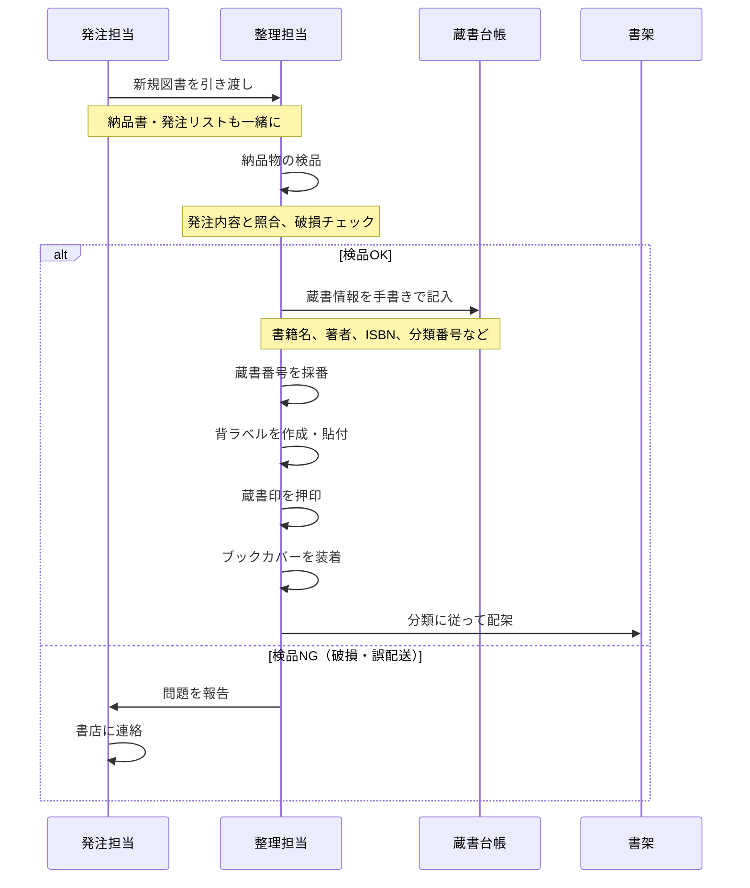
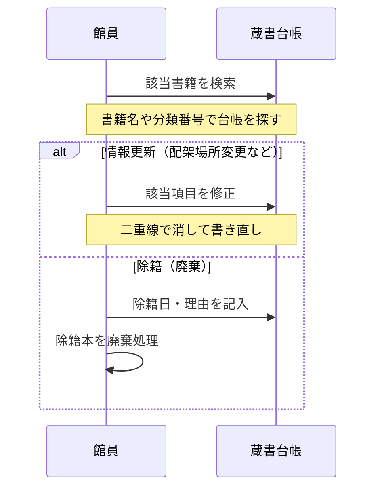

# 蔵書登録・管理業務フロー（AS-IS）

最終更新: 2024-04-01

## 業務概要

| 項目 | 内容 |
|------|------|
| **業務名** | 蔵書登録・管理 |
| **トリガー** | 新規図書の購入、寄贈の受け入れ |
| **終了条件** | 蔵書台帳への登録完了、書架への配架完了 |
| **主な担当** | 図書館員（整理担当） |
| **頻度** | 月に50〜100冊程度 |

---

## スイムレーン図

### 新規蔵書登録フロー

### 蔵書情報更新フロー

---

## プロセス詳細

### プロセス1: 検品

| 項目 | 内容 |
|------|------|
| **担当** | 整理担当 |
| **概要** | 納品された図書を発注内容と照合し、状態を確認 |
| **インプット** | 納品図書、納品書、発注リスト |
| **アウトプット** | 検品完了の図書 |
| **所要時間** | 1冊あたり1〜2分 |
| **使用システム** | なし |

#### 確認項目

- タイトル・著者が発注内容と一致するか
- 破損・汚損がないか
- 冊数が合っているか

### プロセス2: 蔵書台帳記入

| 項目 | 内容 |
|------|------|
| **担当** | 整理担当 |
| **概要** | 蔵書台帳に書籍情報を手書きで記録 |
| **インプット** | 図書現物、奥付情報 |
| **アウトプット** | 蔵書台帳への記録 |
| **所要時間** | 1冊あたり3〜5分 |
| **使用システム** | なし（紙の蔵書台帳） |

#### 記入項目

1. 蔵書番号（連番で採番）
2. 書籍名
3. 著者名
4. 出版社
5. 出版年
6. ISBN（あれば）
7. 分類番号（NDC）
8. 購入日
9. 購入価格
10. 配架場所

### プロセス3: 装備

| 項目 | 内容 |
|------|------|
| **担当** | 整理担当 |
| **概要** | 図書に背ラベル、蔵書印、カバーを装着 |
| **インプット** | 登録済み図書 |
| **アウトプット** | 装備完了図書 |
| **所要時間** | 1冊あたり5〜10分 |
| **使用システム** | なし |

#### 作業内容

1. 背ラベル作成（分類番号を手書き）
2. 背ラベル貼付
3. 蔵書印押印（見返しページ）
4. ブックカバー装着（透明フィルム）

### プロセス4: 配架

| 項目 | 内容 |
|------|------|
| **担当** | 整理担当 |
| **概要** | 分類に従って書架の正しい位置に配置 |
| **インプット** | 装備完了図書 |
| **アウトプット** | 配架完了 |
| **所要時間** | 1冊あたり1〜2分 |
| **使用システム** | なし |

---

## 例外フロー

### 例外パターン1: 寄贈図書の受け入れ

| 項目 | 内容 |
|------|------|
| **発生条件** | 利用者や団体から図書の寄贈がある |
| **発生頻度** | 月に10〜30冊 |
| **対応方法** | 受け入れ可否を判断、可の場合は通常の登録フロー |
| **影響** | 受け入れ判断に時間がかかる |

#### 受け入れ判断基準

- 蔵書として価値があるか
- 状態が良好か
- 重複していないか

### 例外パターン2: 除籍（廃棄）

| 項目 | 内容 |
|------|------|
| **発生条件** | 破損・汚損・紛失・古くなった図書の除籍 |
| **発生頻度** | 年に100〜200冊 |
| **対応方法** | 除籍リスト作成、台帳に除籍記録、廃棄処理 |
| **影響** | 除籍手続きに時間がかかる |

### 例外パターン3: 蔵書点検（棚卸し）

| 項目 | 内容 |
|------|------|
| **発生条件** | 年1回の定期棚卸し |
| **発生頻度** | 年1回 |
| **対応方法** | 全蔵書と台帳を照合、不明本を調査 |
| **影響** | 数日間の臨時休館が必要 |

---

## ボトルネック・課題

| 箇所 | 課題 | 影響 | 改善案 |
|------|------|------|-------|
| 蔵書台帳記入 | 手書きで時間がかかる | 登録遅延 | システム入力 |
| 蔵書台帳記入 | 記入ミス・読みにくい字 | データ品質 | バリデーション |
| 蔵書番号採番 | 手動で連番管理 | 重複リスク | 自動採番 |
| ISBN入力 | 手書きで転記ミス | 検索精度低下 | ISBN外部API連携 |
| 蔵書検索 | 台帳を目視で探す | 検索に時間がかかる | デジタル検索 |
| 蔵書点検 | 全冊手作業で照合 | 休館が必要 | バーコード/RFID |

詳細: [課題分析](../../pain-points/issues-analysis.md)

---

## 変更履歴

| 日付 | バージョン | 変更内容 | 更新者 |
|------|-----------|---------|-------|
| 2024-04-01 | v1.0 | 初版作成 | 高橋 美咲 |

---

**作成者**: 高橋 美咲（PO）
**レビュアー**: 山田 恵子（ベテラン司書）
