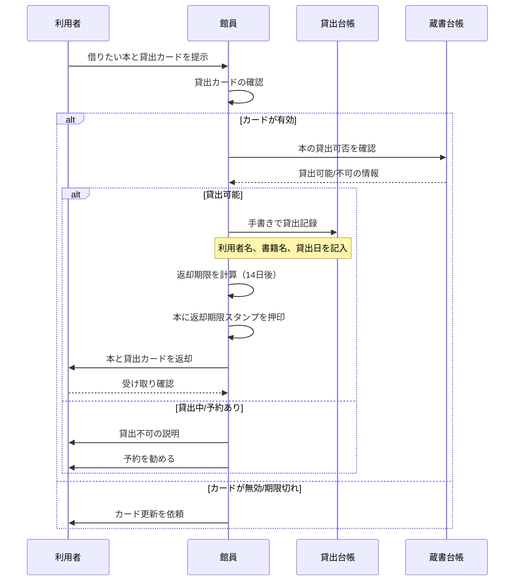

# 貸出業務フロー（AS-IS）

最終更新: 2024-04-01

## 業務概要

| 項目 | 内容 |
|------|------|
| **業務名** | 図書貸出 |
| **トリガー** | 利用者が本を借りたいと申し出る |
| **終了条件** | 貸出カードに記録が完了し、本が利用者に渡される |
| **主な担当** | 図書館員（カウンター担当） |
| **頻度** | 1日あたり平均50〜100件 |

---

## スイムレーン図

---

## プロセス詳細

### プロセス1: 貸出カード確認

| 項目 | 内容 |
|------|------|
| **担当** | 館員 |
| **概要** | 利用者の貸出カードが有効かを確認 |
| **インプット** | 貸出カード |
| **アウトプット** | 有効/無効の判定 |
| **所要時間** | 約10秒 |
| **使用システム** | なし（目視確認） |

#### 確認項目

- カード有効期限が切れていないか
- 名前と顔写真の一致（写真付きの場合）
- 破損・汚損がないか

### プロセス2: 蔵書状態確認

| 項目 | 内容 |
|------|------|
| **担当** | 館員 |
| **概要** | 本が貸出可能な状態かを確認 |
| **インプット** | 借りたい本 |
| **アウトプット** | 貸出可否の判定 |
| **所要時間** | 約30秒〜1分 |
| **使用システム** | なし（蔵書台帳を目視確認） |

#### 確認項目

- 現在貸出中ではないか（蔵書台帳で確認）
- 予約が入っていないか（ホワイトボードで確認）
- 禁帯出資料ではないか

### プロセス3: 貸出記録

| 項目 | 内容 |
|------|------|
| **担当** | 館員 |
| **概要** | 貸出台帳に手書きで記録 |
| **インプット** | 利用者情報、書籍情報、貸出日 |
| **アウトプット** | 貸出台帳への記録 |
| **所要時間** | 約1〜2分 |
| **使用システム** | なし（紙の貸出台帳） |

#### 記入項目

1. 利用者名
2. 利用者番号
3. 書籍名
4. 著者名
5. 貸出日
6. 返却予定日

---

## 例外フロー

### 例外パターン1: 貸出上限超過

| 項目 | 内容 |
|------|------|
| **発生条件** | 利用者がすでに5冊借りている |
| **発生頻度** | 週に3〜5回 |
| **対応方法** | 貸出を断り、返却を促す |
| **影響** | 利用者の不満 |

### 例外パターン2: 予約資料の取り置き貸出

| 項目 | 内容 |
|------|------|
| **発生条件** | 予約者が取り置き資料を受け取りに来た |
| **発生頻度** | 1日に5〜10回 |
| **対応方法** | 予約ホワイトボードで確認し、取り置き棚から取り出す |
| **影響** | 通常より時間がかかる |

---

## ボトルネック・課題

| 箇所 | 課題 | 影響 | 改善案 |
|------|------|------|-------|
| 蔵書台帳確認 | 紙の台帳を探すのに時間がかかる | 待ち時間増加 | デジタル検索 |
| 貸出記録 | 手書きで時間がかかる、誤記入リスク | 効率低下、データ品質 | システム入力 |
| 返却期限計算 | 手計算でミスが発生する | 延滞管理の不備 | 自動計算 |
| 貸出上限確認 | 台帳を遡って確認が必要 | 処理遅延 | リアルタイム表示 |

詳細: [課題分析](../../pain-points/issues-analysis.md)

---

## 変更履歴

| 日付 | バージョン | 変更内容 | 更新者 |
|------|-----------|---------|-------|
| 2024-04-01 | v1.0 | 初版作成 | 高橋 美咲 |

---

**作成者**: 高橋 美咲（PO）
**レビュアー**: 山田 恵子（ベテラン司書）
