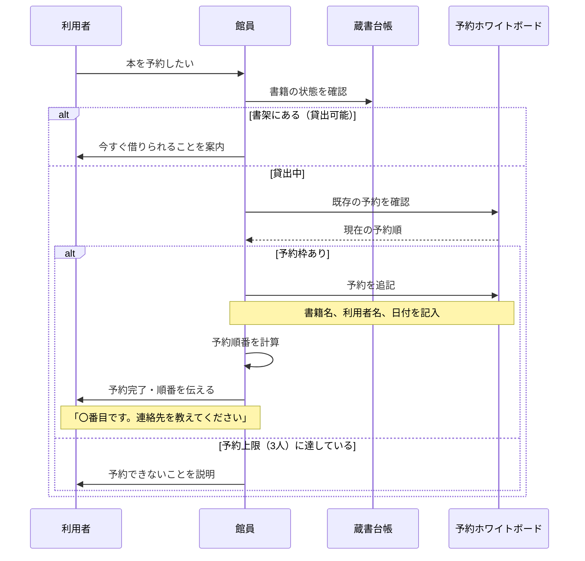
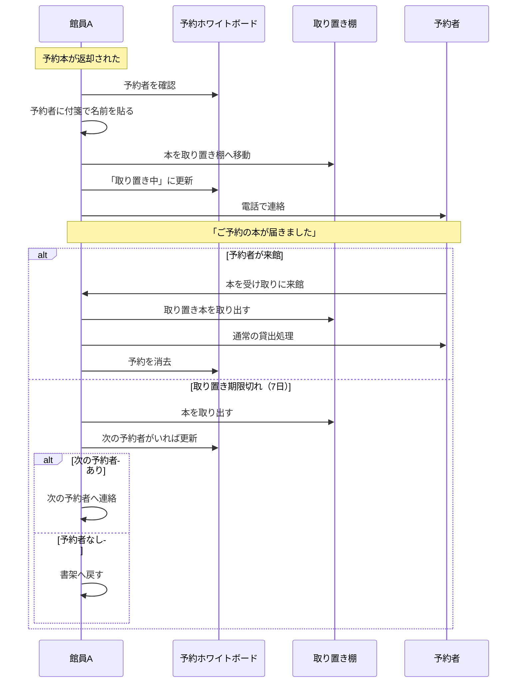

# 予約業務フロー（AS-IS）

最終更新: 2024-04-01

## 業務概要

| 項目 | 内容 |
|------|------|
| **業務名** | 図書予約 |
| **トリガー** | 利用者が貸出中の本を予約したいと申し出る |
| **終了条件** | 予約が完了し、利用者に順番が伝えられる |
| **主な担当** | 図書館員（カウンター担当） |
| **頻度** | 1日あたり平均5〜15件 |

---

## スイムレーン図

### 予約登録フロー

### 予約本の貸出フロー（返却時）

---

## プロセス詳細

### プロセス1: 予約受付

| 項目 | 内容 |
|------|------|
| **担当** | 館員 |
| **概要** | 利用者からの予約依頼を受け付ける |
| **インプット** | 書籍情報、利用者情報 |
| **アウトプット** | 予約登録の完了 |
| **所要時間** | 2〜3分 |
| **使用システム** | なし（ホワイトボード） |

#### 手順

1. 利用者から予約したい本を聞く
2. 蔵書台帳で貸出状況を確認
3. ホワイトボードで既存の予約を確認
4. 予約枠があれば、ホワイトボードに追記
5. 利用者に順番と連絡先確認を伝える

#### 確認項目

- 利用者の貸出カードが有効か
- 同じ本を既に予約していないか
- 予約上限（3冊）に達していないか

### プロセス2: 予約連絡

| 項目 | 内容 |
|------|------|
| **担当** | 館員 |
| **概要** | 予約本が返却されたら予約者に連絡 |
| **インプット** | 予約者の連絡先 |
| **アウトプット** | 予約者への連絡完了 |
| **所要時間** | 5〜10分 |
| **使用システム** | 電話 |

#### 手順

1. 返却された本の予約有無をホワイトボードで確認
2. 予約者がいれば、取り置き棚へ移動
3. ホワイトボードの連絡先を確認
4. 電話で連絡

#### 課題

- 電話がつながらないことが多い
- 連絡先がメモされていないことがある
- 連絡漏れが発生する

### プロセス3: 取り置き管理

| 項目 | 内容 |
|------|------|
| **担当** | 館員 |
| **概要** | 取り置き本の期限管理 |
| **インプット** | 取り置き本、取り置き日 |
| **アウトプット** | 期限内の貸出 or 期限切れ処理 |
| **所要時間** | 日々の確認で5分程度 |
| **使用システム** | なし |

#### 手順

1. 毎朝、取り置き棚の本を確認
2. 取り置き開始日から7日を超えた本を特定
3. 期限切れの本は次の予約者へ or 書架へ

---

## 例外フロー

### 例外パターン1: 予約キャンセル

| 項目 | 内容 |
|------|------|
| **発生条件** | 利用者が予約をキャンセルしたい |
| **発生頻度** | 週に2〜3回 |
| **対応方法** | ホワイトボードから消去、次の予約者がいれば繰り上げ |
| **影響** | ホワイトボードの書き直しが発生 |

### 例外パターン2: 連絡先不明

| 項目 | 内容 |
|------|------|
| **発生条件** | 予約時に連絡先を聞き忘れた |
| **発生頻度** | 月に1〜2回 |
| **対応方法** | 利用者カードから連絡先を探す（見つからないことも） |
| **影響** | 連絡できず、取り置き期限切れになることがある |

### 例外パターン3: 予約順の誤認

| 項目 | 内容 |
|------|------|
| **発生条件** | ホワイトボードの記載が不明瞭で順番を間違える |
| **発生頻度** | 月に1回程度 |
| **対応方法** | 利用者への謝罪と再調整 |
| **影響** | 利用者の不満、信頼低下 |

---

## ボトルネック・課題

| 箇所 | 課題 | 影響 | 改善案 |
|------|------|------|-------|
| 予約受付 | ホワイトボードが見づらい | 記入ミス、見落とし | デジタル管理 |
| 予約連絡 | 電話がつながらない | 連絡遅延 | メール/SMS通知 |
| 予約連絡 | 連絡先のメモ漏れ | 連絡不能 | 利用者情報との紐付け |
| 取り置き管理 | 期限管理が手動 | 期限切れ見落とし | 自動アラート |
| 予約順管理 | 手書きで順番が分かりにくい | 順番ミス | システムで自動管理 |

詳細: [課題分析](../../pain-points/issues-analysis.md)

---

## 業務ルール

| ルール | 内容 |
|--------|------|
| 予約上限 | 1人3冊まで |
| 取り置き期限 | 連絡から7日間 |
| 予約可能冊数 | 1タイトルにつき3人まで |
| 予約順 | 先着順 |

---

## 変更履歴

| 日付 | バージョン | 変更内容 | 更新者 |
|------|-----------|---------|-------|
| 2024-04-01 | v1.0 | 初版作成 | 高橋 美咲 |

---

**作成者**: 高橋 美咲（PO）
**レビュアー**: 山田 恵子（ベテラン司書）
