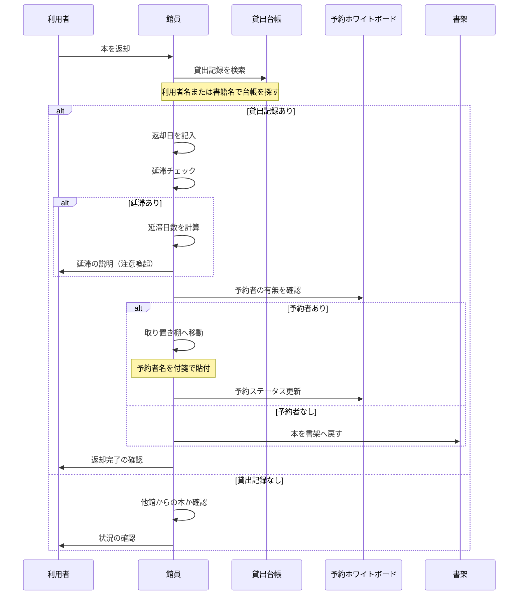

# 返却業務フロー（AS-IS）

最終更新: 2024-04-01

## 業務概要

| 項目 | 内容 |
|------|------|
| **業務名** | 図書返却 |
| **トリガー** | 利用者が本を返却する |
| **終了条件** | 返却記録が完了し、本が書架に戻される |
| **主な担当** | 図書館員（カウンター担当） |
| **頻度** | 1日あたり平均50〜100件 |

---

## スイムレーン図

---

## プロセス詳細

### プロセス1: 貸出記録検索

| 項目 | 内容 |
|------|------|
| **担当** | 館員 |
| **概要** | 返却された本の貸出記録を探す |
| **インプット** | 返却された本 |
| **アウトプット** | 貸出記録の特定 |
| **所要時間** | 30秒〜3分 |
| **使用システム** | なし（紙の貸出台帳） |

#### 手順

1. 本の背表紙から書籍名を確認
2. 貸出台帳で該当の書籍を探す
3. 返却されていない記録（返却日が空欄）を見つける
4. 利用者名を確認

#### 課題

- 台帳が増えると検索に時間がかかる
- 同じ本が複数回貸出されていると特定が困難

### プロセス2: 延滞チェック

| 項目 | 内容 |
|------|------|
| **担当** | 館員 |
| **概要** | 返却期限を過ぎていないかを確認 |
| **インプット** | 返却予定日、本日の日付 |
| **アウトプット** | 延滞有無の判定 |
| **所要時間** | 約10秒 |
| **使用システム** | なし（目視・暗算） |

#### 判断基準

- 本日の日付 > 返却予定日 → 延滞
- 延滞日数 = 本日の日付 − 返却予定日

### プロセス3: 予約確認

| 項目 | 内容 |
|------|------|
| **担当** | 館員 |
| **概要** | 返却された本に予約が入っているかを確認 |
| **インプット** | 返却された本 |
| **アウトプット** | 予約有無、予約者情報 |
| **所要時間** | 30秒〜1分 |
| **使用システム** | なし（ホワイトボード） |

#### 手順

1. 予約ホワイトボードで書籍名を確認
2. 予約者がいれば付箋に予約者名を記入
3. 取り置き棚に移動
4. ホワイトボードに「取り置き中」と記入

### プロセス4: 配架

| 項目 | 内容 |
|------|------|
| **担当** | 館員 |
| **概要** | 返却された本を書架の正しい位置に戻す |
| **インプット** | 返却された本 |
| **アウトプット** | 書架に配置された本 |
| **所要時間** | 1〜3分 |
| **使用システム** | なし |

#### 手順

1. 本の分類番号を確認
2. 該当の書架に移動
3. 分類順に正しい位置に配置

---

## 例外フロー

### 例外パターン1: 返却ポストからの回収

| 項目 | 内容 |
|------|------|
| **発生条件** | 閉館時間外に返却ポストに投函された |
| **発生頻度** | 1日に10〜20冊 |
| **対応方法** | 開館時に一括処理 |
| **影響** | 朝の業務が集中する |

### 例外パターン2: 破損・汚損本の返却

| 項目 | 内容 |
|------|------|
| **発生条件** | 返却された本に破損・汚損がある |
| **発生頻度** | 月に数回 |
| **対応方法** | 状態を記録し、利用者に確認。弁償の場合もある |
| **影響** | 処理時間が長くなる |

### 例外パターン3: 他館からの本

| 項目 | 内容 |
|------|------|
| **発生条件** | 相互貸借で借りた本が返却された |
| **発生頻度** | 週に1〜2回 |
| **対応方法** | 他館返却用の棚に分ける |
| **影響** | 別途発送手続きが必要 |

---

## ボトルネック・課題

| 箇所 | 課題 | 影響 | 改善案 |
|------|------|------|-------|
| 貸出記録検索 | 台帳から探すのに時間がかかる | 待ち時間増加 | バーコード/検索 |
| 延滞チェック | 手計算でミスが発生する | 延滞見落とし | 自動計算・アラート |
| 予約確認 | ホワイトボードを見に行く必要がある | 動線の無駄 | 画面表示 |
| 配架 | 閉館時の返却が朝に集中 | 朝の業務負荷 | 返却時自動通知 |

詳細: [課題分析](../../pain-points/issues-analysis.md)

---

## 変更履歴

| 日付 | バージョン | 変更内容 | 更新者 |
|------|-----------|---------|-------|
| 2024-04-01 | v1.0 | 初版作成 | 高橋 美咲 |

---

**作成者**: 高橋 美咲（PO）
**レビュアー**: 山田 恵子（ベテラン司書）
