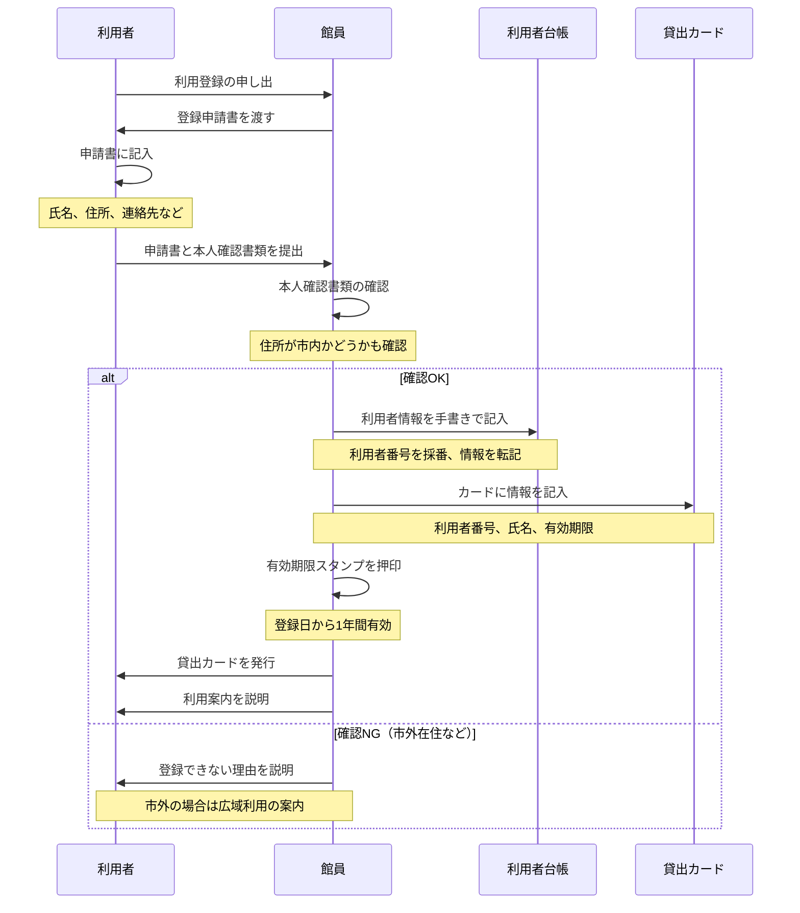
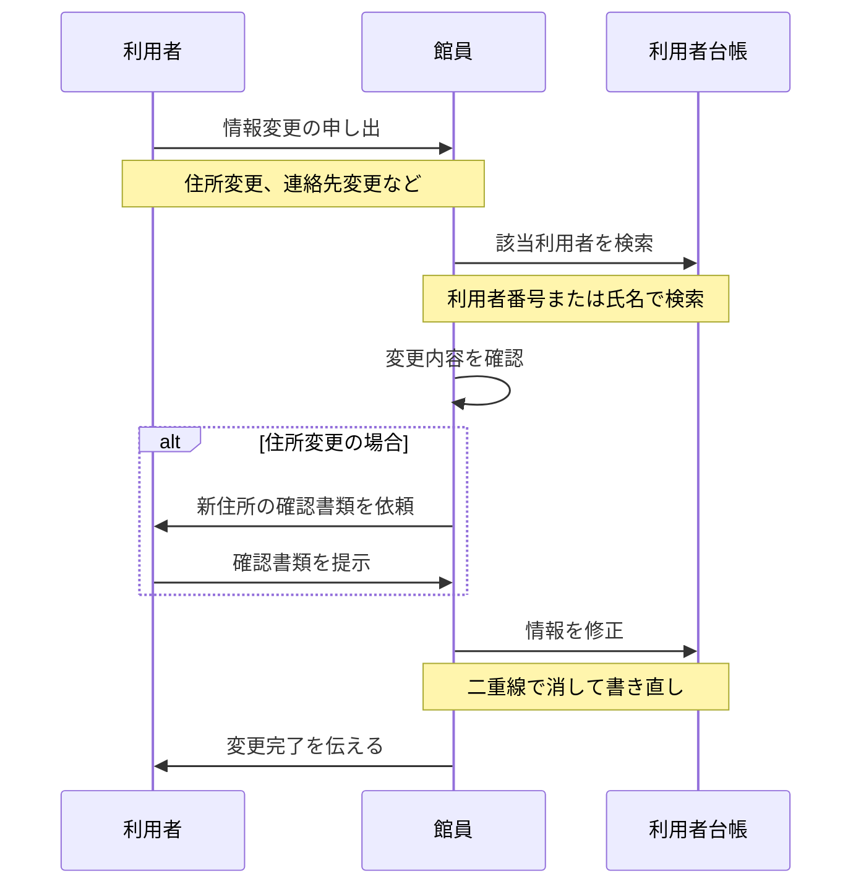
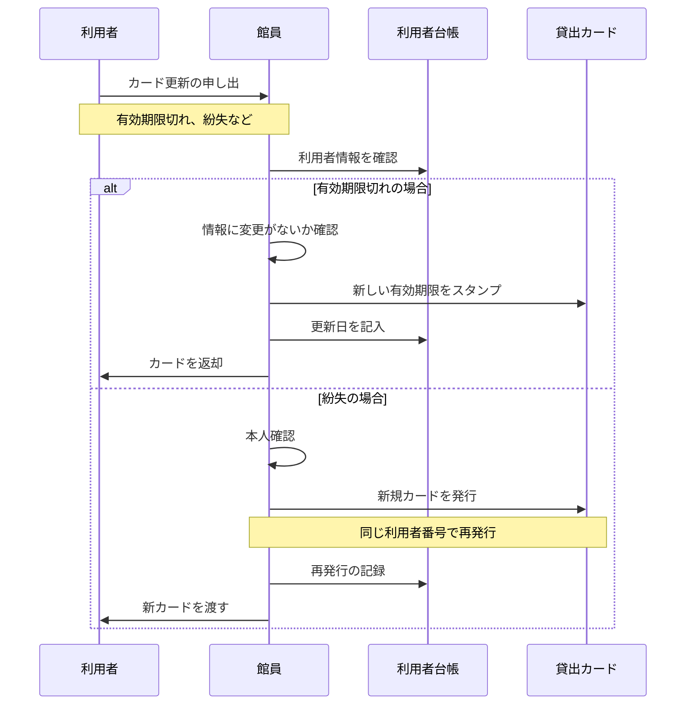

# 利用者登録・管理業務フロー（AS-IS）

最終更新: 2024-04-01

## 業務概要

| 項目 | 内容 |
|------|------|
| **業務名** | 利用者登録・管理 |
| **トリガー** | 新規利用者の登録申請、既存利用者の情報変更 |
| **終了条件** | 貸出カードの発行、利用者台帳への記録完了 |
| **主な担当** | 図書館員（カウンター担当） |
| **頻度** | 新規登録：月に20〜50件、更新：月に10〜20件 |

---

## スイムレーン図

### 新規利用者登録フロー

### 利用者情報更新フロー

### 貸出カード更新フロー

---

## プロセス詳細

### プロセス1: 登録申請受付

| 項目 | 内容 |
|------|------|
| **担当** | 館員 |
| **概要** | 利用者からの登録申請を受け付け、本人確認を行う |
| **インプット** | 登録申請書、本人確認書類 |
| **アウトプット** | 確認済み申請情報 |
| **所要時間** | 3〜5分 |
| **使用システム** | なし |

#### 必要書類

- 登録申請書（館内で記入）
- 本人確認書類（運転免許証、保険証、マイナンバーカードなど）
- 住所確認書類（市外から通勤・通学の場合）

#### 確認項目

- 氏名の一致
- 住所が対象地域内か
- 有効期限内の書類か

### プロセス2: 利用者台帳記入

| 項目 | 内容 |
|------|------|
| **担当** | 館員 |
| **概要** | 利用者台帳に情報を手書きで記録 |
| **インプット** | 確認済み申請情報 |
| **アウトプット** | 利用者台帳への記録 |
| **所要時間** | 2〜3分 |
| **使用システム** | なし（紙の利用者台帳） |

#### 記入項目

1. 利用者番号（連番で採番）
2. 氏名（ふりがな）
3. 生年月日
4. 住所
5. 電話番号
6. 登録日
7. 有効期限
8. 備考（通勤・通学先など）

### プロセス3: 貸出カード発行

| 項目 | 内容 |
|------|------|
| **担当** | 館員 |
| **概要** | 貸出カードに情報を記入し、発行する |
| **インプット** | 利用者番号、利用者情報 |
| **アウトプット** | 発行済み貸出カード |
| **所要時間** | 1〜2分 |
| **使用システム** | なし |

#### カード記載項目

1. 図書館名
2. 利用者番号
3. 氏名
4. 有効期限

---

## 例外フロー

### 例外パターン1: 市外在住者の登録

| 項目 | 内容 |
|------|------|
| **発生条件** | 市外在住だが市内に通勤・通学している |
| **発生頻度** | 月に5〜10件 |
| **対応方法** | 通勤・通学先の証明書を確認し、登録可とする |
| **影響** | 確認書類が増え、処理時間が長くなる |

### 例外パターン2: 未成年者の登録

| 項目 | 内容 |
|------|------|
| **発生条件** | 小学生以下の子どもが登録する |
| **発生頻度** | 月に10〜20件 |
| **対応方法** | 保護者の同意と連絡先を確認 |
| **影響** | 保護者同伴が必要なことがある |

### 例外パターン3: カード紛失

| 項目 | 内容 |
|------|------|
| **発生条件** | 利用者がカードを紛失した |
| **発生頻度** | 月に2〜5件 |
| **対応方法** | 本人確認後、同じ番号で再発行 |
| **影響** | 悪用防止のため旧カードは無効化が必要 |

### 例外パターン4: 個人情報の開示請求

| 項目 | 内容 |
|------|------|
| **発生条件** | 利用者が自分の貸出履歴等を確認したい |
| **発生頻度** | 年に数件 |
| **対応方法** | 本人確認後、台帳から該当情報を転記して提供 |
| **影響** | 検索・転記に時間がかかる |

---

## ボトルネック・課題

| 箇所 | 課題 | 影響 | 改善案 |
|------|------|------|-------|
| 利用者台帳記入 | 手書きで時間がかかる | 待ち時間増加 | システム入力 |
| 利用者番号採番 | 手動で連番管理 | 重複リスク | 自動採番 |
| 利用者検索 | 台帳を目視で探す | 検索に時間がかかる | デジタル検索 |
| 情報更新 | 二重線での修正で見づらくなる | データ品質低下 | 履歴管理 |
| 有効期限管理 | 期限切れの把握が困難 | 更新漏れ | 自動通知 |
| カード紛失対応 | 旧カード無効化の仕組みがない | 悪用リスク | ステータス管理 |

詳細: [課題分析](../../pain-points/issues-analysis.md)

---

## 業務ルール

| ルール | 内容 |
|--------|------|
| 登録対象 | 市内在住・在勤・在学者 |
| 有効期限 | 登録日から1年間 |
| 貸出上限 | 1人5冊まで |
| 貸出期間 | 14日間 |
| 更新条件 | 本人確認ができること |

---

## 変更履歴

| 日付 | バージョン | 変更内容 | 更新者 |
|------|-----------|---------|-------|
| 2024-04-01 | v1.0 | 初版作成 | 高橋 美咲 |

---

**作成者**: 高橋 美咲（PO）
**レビュアー**: 山田 恵子（ベテラン司書）
