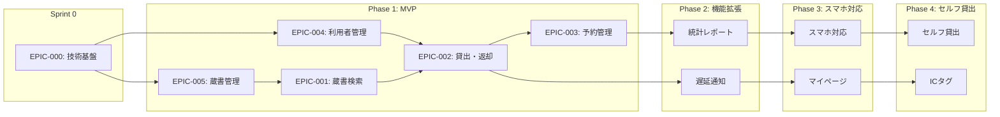

# プロダクトロードマップ

<!--
プロダクトの中長期的な計画を可視化します
更新頻度: 四半期ごと
-->

最終更新: 2024-04-17

## ロードマップ概要

```
2024年                                          2025年         2026年
4月       5月       6月       7月       8月       9月       10月〜12月    1月〜6月      〜
|---------|---------|---------|---------|---------|---------|------------|------------|----------|
| Sprint 0| Sprint 1-4              | Sprint 5-9        | Sprint 10  |            |          |          |
| 環境構築| マスタ系+蔵書検索       | 貸出・返却・予約  | テスト+UAT | Phase 2    | Phase 3  | Phase 4  |
|---------|---------|---------|---------|---------|---------|------------|------------|----------|
     ↑         ↑                           ↑         ↑           ↑           ↑
  4/29       5/13                        7/22      9/30       12/末       6/末
  Sprint 0   Sprint 1                   Sprint 5   MVP        機能拡張    スマホ
  開始       開始                       開始       リリース   リリース    対応
```

## フェーズ一覧

| フェーズ | 期間 | 主な目標 | ステータス |
|---------|------|---------|----------|
| Sprint 0 | 2024/4/29〜5/10 | 技術基盤構築 | Planned |
| Phase 1（MVP） | 2024/4〜9 | 基本機能のデジタル化 | Planned |
| Phase 2 | 2024/10〜12 | 機能拡張（統計、通知） | Planned |
| Phase 3 | 2025/1〜6 | スマートフォン対応 | Planned |
| Phase 4 | 2026〜 | セルフ貸出・ICタグ対応 | Planned |

---

## Epic 一覧

| Epic ID | 名称 | 優先度 | 見積もり | 担当スプリント |
|---------|------|--------|---------|---------------|
| EPIC-000 | 技術基盤構築 | Critical | S（1スプリント） | Sprint 0 |
| EPIC-001 | 蔵書検索機能 | High | M（2スプリント） | Sprint 3-4 |
| EPIC-002 | 貸出・返却機能 | High | L（3スプリント） | Sprint 5-7 |
| EPIC-003 | 予約管理機能 | Medium | M（2スプリント） | Sprint 8-9 |
| EPIC-004 | 利用者管理機能 | High | S（1スプリント） | Sprint 1-2 |
| EPIC-005 | 蔵書管理機能 | High | S（1スプリント） | Sprint 1-2 |

**見積もり凡例**: S（1スプリント）、M（2スプリント）、L（3スプリント）

---

## フェーズ詳細

### Sprint 0: 技術基盤構築（EPIC-000）

**期間**: 2024/4/29〜5/10（2週間）

**目標**: 開発環境の構築、技術基盤の整備

| Story ID | 内容 | 担当 |
|----------|------|------|
| ST-000-1 | 開発環境構築（Docker, Node.js, PostgreSQL） | 伊藤 |
| ST-000-2 | データベース設計（ER図、テーブル定義） | 伊藤 |
| ST-000-3 | CI/CDパイプライン構築 | 小林 |
| ST-000-4 | 認証基盤（NextAuth.js） | 小林 |
| ST-000-5 | 共通レイアウト・デザインシステム | 渡辺 |
| ST-000-6 | AWS環境構築（検証環境） | 伊藤 |

**成功基準**:
- Docker Compose で全サービスが起動
- CI/CDパイプラインが動作
- 認証基盤が動作

---

### Phase 1: MVP（2024年4月〜9月）

**目標**: 基本機能のデジタル化、Excel運用からの脱却

| スプリント | Epic | 内容 |
|-----------|------|------|
| Sprint 1-2 | EPIC-004 + EPIC-005 | マスタ系（利用者・蔵書管理）※並行開発 |
| Sprint 3-4 | EPIC-001 | 蔵書検索機能 |
| Sprint 5-7 | EPIC-002 | 貸出・返却機能 |
| Sprint 8-9 | EPIC-003 | 予約管理機能 |
| Sprint 10 | - | 統合テスト + UAT |

**成功基準**:
- Excel台帳の完全廃止
- 職員全員がシステム操作可能
- 重大バグなし
- KPI達成（検索30秒以内、貸出1分以内、予約漏れゼロ）

---

### Phase 2: 機能拡張（2024年10月〜12月）

**目標**: 運用効率の向上、データ活用の開始

| 機能 | 優先度 | 概要 |
|------|--------|------|
| 統計レポート | Must | 日別貸出冊数、人気本ランキング |
| 遅延通知メール | Should | 返却期限超過時の自動通知 |
| 貸出上限チェック | Should | 利用者ごとの貸出制限 |
| ISBN API連携 | Could | 書籍情報の自動取得 |

**成功基準**:
- 月次統計レポートの自動生成
- 遅延通知による返却率向上

---

### Phase 3: スマートフォン対応（2025年1月〜6月）

**目標**: 利用者の利便性向上、アクセシビリティ拡大

| 機能 | 優先度 | 概要 |
|------|--------|------|
| レスポンシブUI | Must | スマホ・タブレット対応 |
| マイページ | Must | 貸出履歴、予約状況確認 |
| 一般利用者ログイン | Must | 利用者認証機能 |
| プッシュ通知 | Should | 予約可能通知、返却リマインダー |

**成功基準**:
- スマートフォンからの蔵書検索利用率30%
- 利用者アンケート満足度4.0以上

---

### Phase 4: セルフ貸出・ICタグ対応（2026年〜）

**目標**: 完全デジタル化、無人運用の基盤構築

| 機能 | 優先度 | 概要 |
|------|--------|------|
| セルフ貸出端末 | Must | 利用者自身による貸出処理 |
| ICタグ管理 | Must | 蔵書のICタグによる管理 |
| 学校図書館連携 | Should | 市内小中学校との蔵書共有 |

---

## 依存関係



---

## リスクと考慮事項

| フェーズ | リスク | 対策 |
|---------|--------|------|
| Sprint 0 | 環境構築の遅延 | 2週間を死守、問題発生時は即座に報告 |
| Phase 1 | 職員の習熟不足 | 早期トレーニング、マニュアル整備、並行運用期間の設定 |
| Phase 1 | 既存データ移行の負荷 | 新規優先、既存は段階的入力 |
| Phase 2 | 予算追加の不確実性 | Phase 1の効果測定による予算申請 |
| Phase 3 | 利用者のIT格差 | 高齢者向けサポート体制 |
| Phase 4 | 設備投資の規模 | 段階的導入、費用対効果検証 |

---

## 変更履歴

| 日付 | 変更内容 | 更新者 |
|------|---------|-------|
| 2024-04-15 | TO-BEビジョン共有会で案を共有 | 田中PM |
| 2024-04-17 | 初版作成（正式文書化） | 田中PM |
| 2024-04-22 | Epic洗い出しワークショップの結果を反映 | 鈴木SM |

---

**責任者**: 高橋 美咲（プロダクトオーナー）
**次回レビュー**: 2024-05-13（Sprint 1 開始時）
